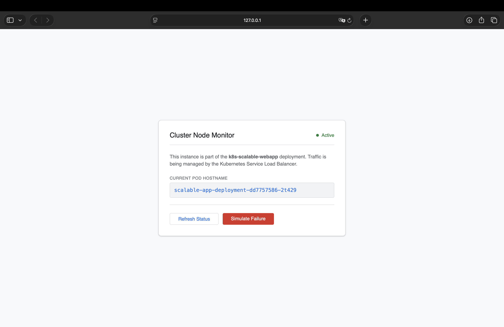

# Kubernetes Scalable Web App ☸️

This project demonstrates the deployment and management of a containerized web application using **Kubernetes**. The goal is to showcase core orchestration features like automated recovery, traffic distribution, and resource constraints.

## 🛠 Key Implementations

- **Self-Healing Infrastructure:** Configured **Liveness and Readiness probes** to monitor application health. If a process fails, Kubernetes automatically replaces the affected pod to maintain service availability.
- **Resource Management:** Defined **CPU and Memory limits** to ensure predictable performance and prevent resource contention within the cluster.
- **Load Balancing:** Implemented a Kubernetes Service to distribute incoming traffic across multiple pod replicas.
- **Monitoring Dashboard:** A Python Flask application designed to display real-time host information, making it easier to track pod rotations and system state.

## 🧪 Simulation Scenarios

### 1. Resilience Testing
The dashboard includes a "Simulate Failure" feature. When triggered, the application process terminates, allowing you to observe how Kubernetes detects the failure and provisions a new pod.
- **Action:** Click "Simulate Failure" and run `kubectl get pods`
- **Observation:** Notice the `RESTARTS` count increases as Kubernetes self-heals the deployment.

### 2. Manual Scaling
The deployment is configured for 3 replicas by default, but can be scaled instantly to handle more traffic:
```
kubectl scale deployment scalable-app-deployment --replicas=10
```

## 🚀 Deployment Guide
### 1. Prepare Environment: 
```
minikube start
```

### 2. Build Container Image: 
```
eval $(minikube docker-env)
docker build -t scalable-app:v3 .
```

### 3. Deploy Manifests: 
```
kubectl apply -f deployment.yaml ve kubectl apply -f service.yaml
```

### 4. Access Application: 
```
minikube service scalable-app-service
```


## 🧠 Key Learning Outcomes
Through this project, I have gained practical experience in:

- **Orchestration Logic:** Moving from standalone Docker containers to a managed cluster environment.

- **Declarative Configuration:** Understanding how .yaml manifests define the "desired state" of an infrastructure.

- **Health Management:** Implementing probes to differentiate between a running container and a functional application.

- **Scaling & Load Balancing:** Observing how Kubernetes abstracts networking to provide a single entry point for multiple instances.


### 🖥️ Application Dashboard
 
*A minimalist system monitor dashboard that visualizes active node information.*


